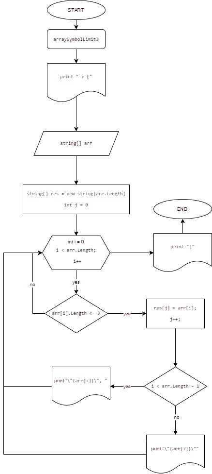
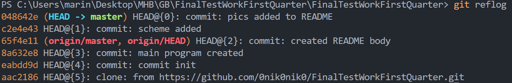

# Итоги блока, 1-я четверть

**Задача:** Написать программу, которая из имеющегося массива строк формирует массив из строк, длина которых меньше
либо равна 3 символа. Первоначальный массив можно ввести с клавиатуры, либо задать на старте выполнения алгоритма.
При решении не рекомендуется пользоваться коллекциями, лучше обойтись исключительно массивами.

**Пример:**

["hello", "2", "world", ":-)"] -> ["2", ":-)"]

["1234", "1567", "-2", "computer science"] -> ["-2"]

["Russia", "Denmark", "Kazan"] -> []

*Краткое описание действий:*
   1. Ссылка на репозиторий на GitHub: https://github.com/0nik0nik0/FinalTestWorkFirstQuarter
   2. Блок-схема алгоритма (основной содержательной части выделенной в отдельный метод `void arraySymbolLimit3`:
    
  

   1. Алгоритм решения: на старте задаем 3 исходных массива, которые будем преобразовывать, а также двумерный массив
    (вкючающий все исходные) для удобства вывода решения данной задачи. Затем создаем основную функцию решения задачи
    при помощи метода `void` и называем ее `arraySymbolLimit3`. Она необходимо для перебора каждого элемента исходного
    массива и вывода пребразованнаго массива с необходимым количеством символов (<= 3). Далее создаем метод `void ShowArray`,
    который в последующем используем для вывода исходых массивов в терминал. После этого создаем метод `void PrintMatrix`,
    который позволяет нам вывести на экран все 3 исходных массива, а также их пребразованные форматы. В завершении просто
    вывызвем данный метод, обращаясь к нему, для вывода в терминал полного решения поставленной задачи.
   2. При решении данной задачи были выполнены последовательно сделанные коммиты:

